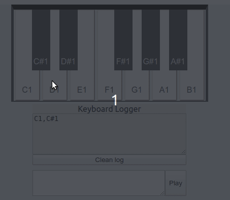
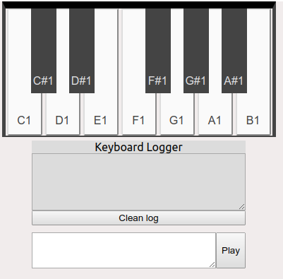
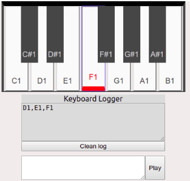
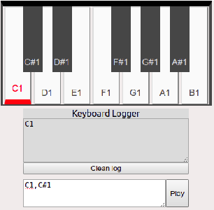

This is a basic piano keyboard interactive app without sound or Audio as per my client's current requirements.

project was bootstrapped with [Create React App](https://github.com/facebook/create-react-app).

## Basic piano keyboard
This project is a basic piano keyboard created using HTML and CSS without Audio.

## Features
These are the basic features
* Highlight a clicked piano key.
* Keep log of the pressed key.
* Ability to clear the log.
* Ability to auto-play comma separated keys.
* Ability to have multiple pianos on the same page.

All Features interacting

Default view

View when a key is pressed

View when auto play is done

## How to build
In the project directory, you run
### `yarn start`

Runs the app in the development mode. 
Open [http://localhost:3000](http://localhost:3000) to view it in the browser.

The page will reload if you make edits. 
You will also see any lint errors in the console.
